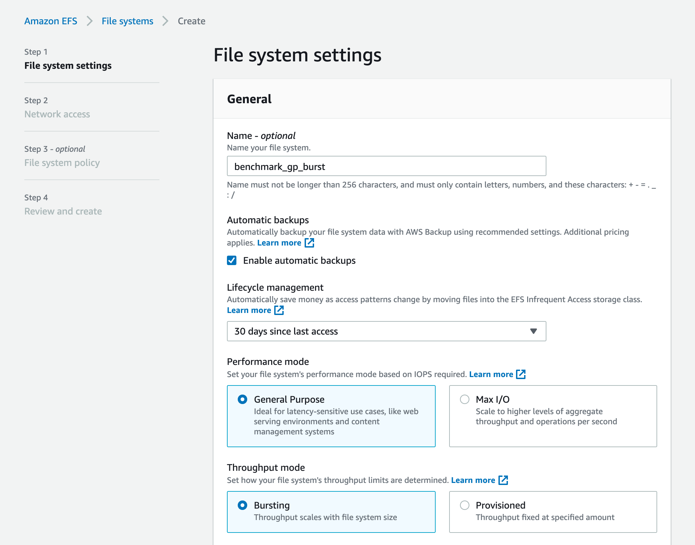
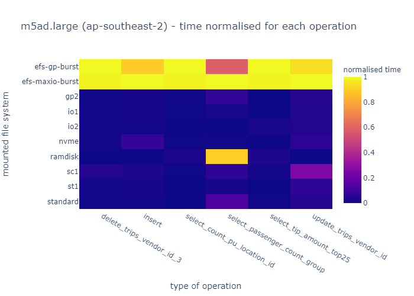

# Diskracer - AWS benchmarking utility (beta)

```

    .___.__        __
  __| _/|__| _____|  | ______________    ____  ___________
 / __ | |  |/  ___/  |/ /\_  __ \__  \ _/ ___\/ __ \_  __ \
/ /_/ | |  |\___ \|    <  |  | \// __ \\  \__\  ___/|  | \/
\____ | |__/____  >__|_ \ |__|  (____  /\___  >___  >__|
	 \/         \/     \/            \/     \/    \/

@bennydee & @ikiko
```

Diskracer benchmarks various storage options (EBS, EFS) within AWS and provide benchmarking and price/performance ratios for your workloads.

# Usage

>**NOTE: Do not use this on a production system, only use a temporary instance since each volume will be destroyed and reformatted during the benchmarking process.**

Diskracer will benchmark the following tests for each EBS/EFS volume using the default settings and provided IOPS:

* General Purpose (gp2)
* Provisioned IOPS (io1)
* Provisioned IOPS (io2)
* Cold HDD (sc1)
* Throughput Optimized (st1)
* Magnetic (standard)
* Local NVMe disk (e.g for instances that include one)
* ramdisk (tmpfs)

EFS volumes:

* EFS (General purpose - Burst)
* EFS (MaxIO - Burst)

## Step 1

First create an instance type you would like to benchmark, in this example we are using `m5ad.large` in the `ap-southeast-2` region.

The `m5ad.large` provides the following:

| vCPU | Memory   | Storage (GiB) |  Network Bandwidth (Gbps)  |  EBS Bandwidth (Mbps) |
|---|---|---|---|---|
|  2  |  8  |  75 | Up to 10  |  Up to 2,880  |

Upon creating the instance provision the following volumes in sequence for the specified devices, and enable "Delete on Termination" to cleanup after the benchmarking process.

* /dev/sdb - gp2 - 300 IOPS - 100 GB
* /dev/sdc - io1 - 5,000 IOPS - 100 GB
* /dev/sdd - io2 - 50,000 IOPS - 100 GB
* /dev/sde - sc1 ( 2 / 8 MB/s) - 500 GB size minimum
* /dev/sdf - st1 ( 4 / 25 MB/s) - 500 GB size minimum
* /dev/sdg - standard (N/A) - 100 GB

Sample volumes created via the AWS console using the default provided IOPS and throughput:


## Step 2

Once the instance is launched, create two new volumes in EFS standard volumes to benchmark:

* EFS (General purpose - Burst)
* EFS (MaxIO - Burst)

Note the hostname for each volume (e.g fs-xyz.efs.ap-southeast-2.amazonaws.com) which will be used in step 4 for mounting the volume.



## Step 3

SSH into the new instance and git checkout this repo for the CWD.

```
git clone https://github.com/benduncan/diskracer.git
cd diskracer
```


## Step 4 - Format the new disks

Once the required EBS and EFS volumes are created above, use the `tools/init.pl` script to automatically partition each volume, format the filesystem as `ext4` and mount the volume including EFS (NFS).

Usage:

```
sudo perl tools/init.pl $EFS1.efs.ap-southeast-2.amazonaws.com $EFS2.efs.ap-southeast-2.amazonaws.com
```

Where $EFS1 is a EFS "maxio-burst" volume and $EFS2 is a "gp-burst" volume created in Step 2

## Step 4 - Confirm each volume mounted

```
# df -H
Filesystem                                      Size  Used Avail Use% Mounted on
tmpfs                                           2.2G     0  2.2G   0% /mnt/ramdisk
$EFS1.efs.ap-southeast-2.amazonaws.com:/        9.3E   90G  9.3E   1% /mnt/efs-maxio-burst
$EFS2.efs.ap-southeast-2.amazonaws.com:/        9.3E   90G  9.3E   1% /mnt/efs-gp-burst
/dev/nvme4n1                                    106G   63M  101G   1% /mnt/io2
/dev/nvme6n1                                    529G   76M  502G   1% /mnt/sc1
/dev/nvme7n1                                     74G   55M   70G   1% /mnt/nvme
/dev/nvme2n1                                    529G   76M  502G   1% /mnt/st1
/dev/nvme3n1                                    106G   63M  101G   1% /mnt/io1
/dev/nvme5n1                                    106G   63M  101G   1% /mnt/standard
/dev/nvme1n1                                    106G   63M  101G   1% /mnt/gp2
```

For a fair benchmark between each volume, EFS will provision IOPS automatically depending on the size of the volume in use. For the benchmark we are using the minimum 100 GB per volume and since the EFS volumes are empty, a 100GB file can be created to fill the disk and provide default IOPS to match the other provisioned disk sizes.

```
sudo sh tools/efs-padding.sh
```

Note this process may take 15mins+ to provision a generated 100 GB image on each EFS volume.

## Step 6 - Run the DD benchmark

For the first set of benchmarks, run the `dd` benchmarking script which will test the following benchmarks for each volume.

* Write
* Read (Cache enabled)
* Read (Cache disabled)

For 5 specific tests, each with a different block-size and count to simulate real-world workloads.

* blocksize=8k count=256 size=2M
* blocksize=64k count=128 size=8M
* blocksize=512k count=64 size=32M
* blocksize=4096k count=32 size=128M
* blocksize=32768k count=16 size=512M

Run the benchmark:

```
sudo perl tools/dd-benchmark.pl > reports/m5ad.large.ap-southeast-2-dd.csv
```

Note this will take 5 mins+ to complete.

## Step 7 - Run the taxi database benchmark

To reflect a real-world workload a sample from the ["1 Billion+ Taxi Rides from NYC"](https://toddwschneider.com/posts/analyzing-1-1-billion-nyc-taxi-and-uber-trips-with-a-vengeance/) dataset is available for benchmarking purposes.

First download the sample dataset and prepare the environment to run the next benchmark.

```
sudo sh tools/taxi-setup.sh
```

This will download a sample 1GB CSV file (with 8,759,875 rows) used for sqlite benchmarking on each EBS/EFS volume.

### Tests in the benchmark include:

Insert (write 8.7M rows):

```
pragma journal_mode=memory;
.mode csv
.separator ','
.import /mnt/ramdisk/yellow_tripdata_2018-01.csv trips
```

Select (read):

```
select passenger_count, sum(total_amount) from trips group by passenger_count
```

```
select count(pu_location_id) from trips
```

```
select fare_amount, tip_amount from trips where fare_amount > 100 order by tip_amount desc limit 25
```

Update (read/write):

```
update trips set vendor_id=3 where vendor_id=2
```

Delete (read/write):

```
delete from trips where vendor_id=3
```

To run the tests it's recommend using `nohup` to run the process in the background, since the benchmark may take 30mins+ to complete.

```
sudo nohup perl tools/taxi-sqlite-benchmark.pl > reports/m5ad.large.ap-southeast-2-taxi-sqlite.csv &
```

## Step 8 - Analyzing the results

Once benchmarking is complete reference the CSV files in the `reports/*` directory for analysis.

### m5ad.large (ap-southeast-2)

* [dd benchmark](./reports/m5ad.large.ap-southeast-2-dd.csv)
* [sqlite benchmark](./reports/m5ad.large.ap-southeast-2-taxi-sqlite.csv)

## Step 9

Once complete the temporary instance can be terminated and since `Delete on Termination` was enabled for each EBS volume, these will be automatically removed from your account and will not incur any further billing.

The two EFS volumes created can be removed via the AWS console on completion of the benchmark.

# Analyzing the benchmark results

The directory `analysis/` contains jupyter notebooks that can be used to visualise the output data. Plots are saved as `.html` files in the `datavis/` directory.

### Cost/speed ratio for read-nocache operations


### Cost/speed ratio for write operations


### Cost * operation time normalised


### Time normalised for each operation



# Todo

- [x] First beta using dd / taxi dataset
- [ ] Adding Wikipedia dump (16GB compressed) benchmark
- [x] Add Jupyter notebook to analyze benchmark results
- [ ] Add Amazon FSx for Lustre FS test
- [ ] Add FUSE mount for S3 test
- [ ] Test Nitro based AMD instances vs Intel
- [ ] Test different instance types:
    - [x] m5ad.large
    - [ ] a1.xlarge
    - [ ] m6gd.large
    - [ ] m5dn.large
    - [ ] m4.large
